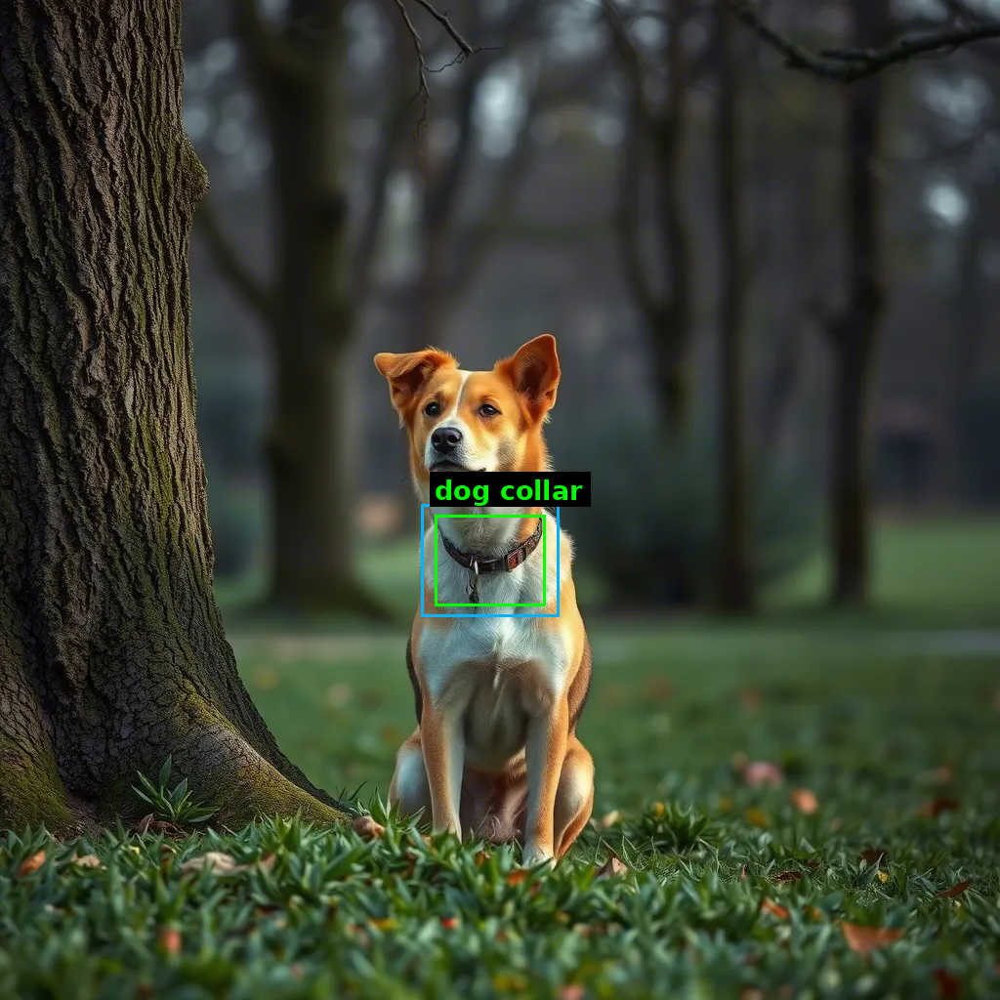
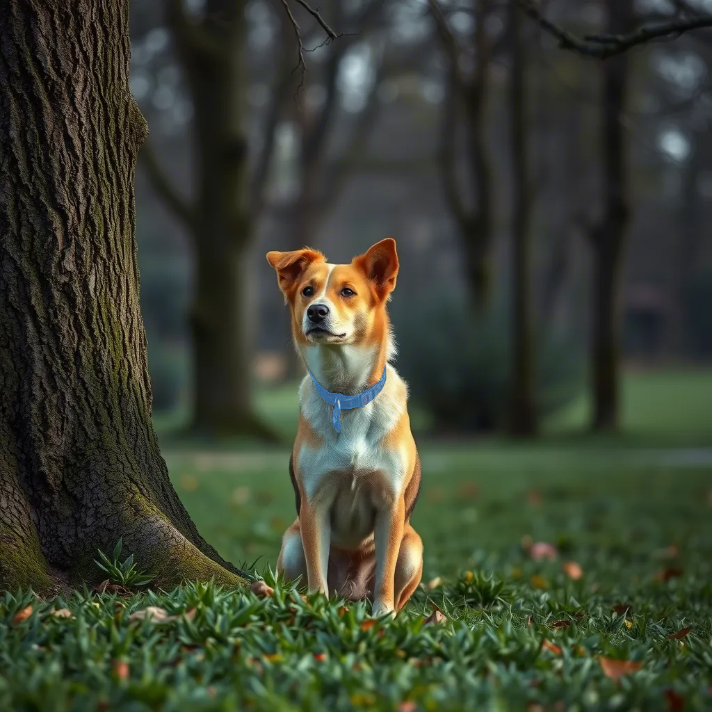
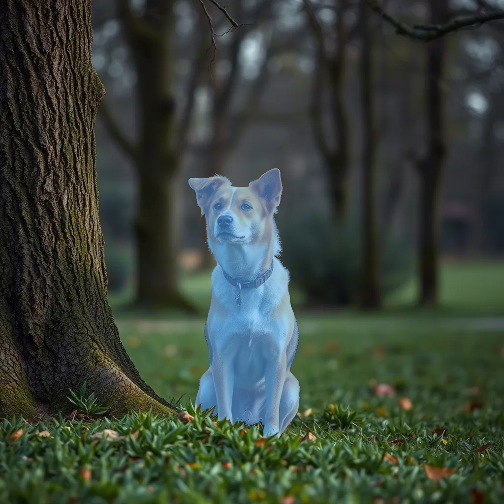
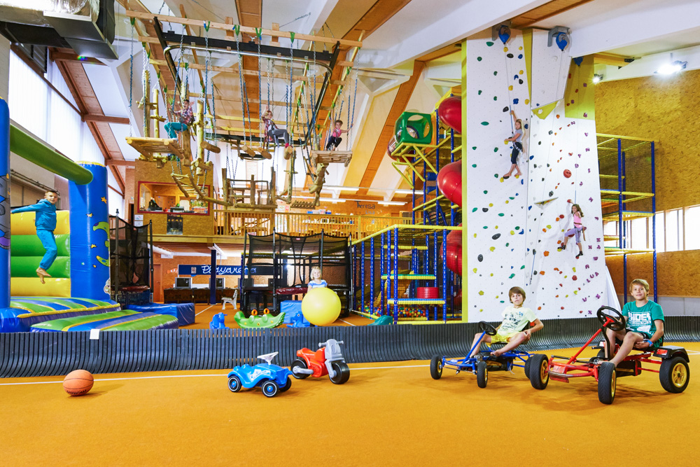
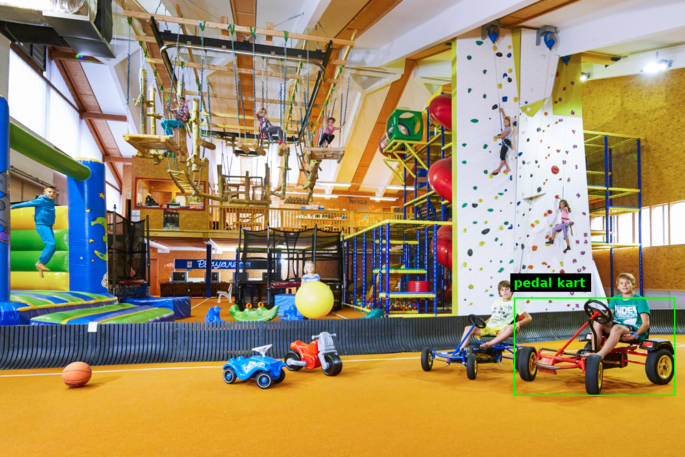
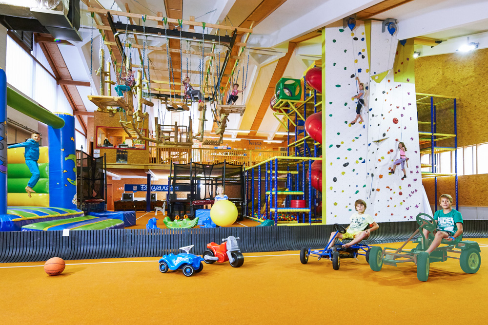

# Any Prompt DIS — Dichotomous Image Segmentation from Any Prompt

**Any Prompt DIS** adds a vision-language **grounding** layer on top of
[FlowDIS](https://flowdis.github.io/), so you can isolate an object from a **complex
natural-language description**, a **single click**, or a **manual box** — not just a single
keyword. A VLM reasons about which object you mean and locates it (bounding box + a concise
*object prompt*); we crop that region and let FlowDIS produce a clean, high-detail matte.
A quantized **low-VRAM** build (INT8 ConvRot DiT + INT4 T5, no CPU offload) runs the full
pipeline on a 24 GB card — see [Updates](#updates).

---

## Updates

- **2026-07-14 — Low-VRAM mode, no CPU offload.** The FlowDIS DiT runs in INT8 with
  [ConvRot](https://arxiv.org/abs/2512.03673) rotations (fused kernel; the quantized linear
  layers run **~1.5× faster** than their bf16 counterparts), and the T5-XXL encoder in
  AWQ-INT4 via [nunchaku](https://huggingface.co/nunchaku-ai/nunchaku-t5) (3 GB vs 9 GB
  weights). Enable with `--int8 --t5-int4` on the CLIs or
  `FLOWDIS_INT8=1 FLOWDIS_T5_INT4=1` for the Gradio app.

  | | bf16 | low-VRAM (int8 + int4) |
  |---|---|---|
  | Resident weights | 31.7 GiB | **17.4 GiB** (−45%) |
  | Peak VRAM, 512² end-to-end | 32.6 GiB | **18.4 GiB** (−44%) |
  | Peak VRAM, 1024² end-to-end | 35.2 GiB | **21.0 GiB** (−40%, fits a 24 GB card) |
  | Inference speed, end-to-end | 1× | **~1.1×** (the un-quantized T5 encode and AE decode dominate the remaining time) |

  <sub>End-to-end = T5 + CLIP + 2-step sampling + AE decode on a single image; peak VRAM is
  `torch.cuda.max_memory_allocated()`. The Gradio app defaults to 512² — segmentation runs
  on the grounded crop, so 512² is usually sufficient.</sub>
- **2026-07-14 — Plain mode (no VLM).** The Gradio app gained a `Plain (no VLM)` mode that
  runs FlowDIS directly on the full image — works fully offline, no API key needed.
- **2026-07-14 — Local VLM backend in the app.** `VLM_BACKEND=local QWEN_VLM_PATH=...`
  serves grounding from a local Qwen-VL checkpoint instead of the cloud API (crop padding
  defaults higher there, since local boxes are less tight).

---

## Any Prompt DIS vs. plain FlowDIS

Plain FlowDIS is trained for dichotomous (salient-object) segmentation: with a part-level
prompt like `dog collar` it still returns the whole salient dog. Any Prompt DIS grounds the
phrase first and lets FlowDIS segment only the grounded crop, so the mask covers just the
collar.

**Prompt:** `dog collar`  
**Grounding result** (`google/gemini-3.1-pro-preview`): `label="dog collar"`,
`bbox=[445, 527, 558, 620]` ([JSON](assets/compare/grounding.json))

| Input | Grounding | Any Prompt DIS (ours) | Plain FlowDIS |
|---|---|---|---|
|  |  |  |  |

---

## Disambiguate Text Prompt

When the prompt describes one instance among similar objects, the VLM first resolves the
target and emits a structured grounding result. FlowDIS then segments only that grounded
crop.

**Input prompt:** `the pedal kart ridden by the kid wearing a cyan T-shirt`  
**Grounding result:** `label="pedal kart"`, `bbox=[750, 436, 986, 578]`,
`coord_hypothesis="norm_1000"`

| Input | Grounding Result | Seg Overlay |
|---|---|---|
|  |  |  |

The grounding artifact is also saved as JSON, including the raw VLM response, under
[`assets/disambiguate/grounding.json`](assets/disambiguate/grounding.json).

---

## Demos

> Full-quality MP4s are committed under [`assets/demo/`](assets/demo/) and embedded with
> `<video>` tags pointing at the raw files in this repo. (If a player doesn't render on your
> fork, drag-drop each `.mp4` into the README editor on github.com and paste the generated
> `user-attachments` URL — that also auto-embeds and is fully self-contained.)

**Text prompt** — describe the object you want in natural language; the VLM grounds it, FlowDIS segments it:

https://github.com/user-attachments/assets/7e559a6a-c77f-4963-901b-cae39e994a95

**Point click** — click the object you want; the VLM grounds it, FlowDIS segments it:

https://github.com/user-attachments/assets/893d29e0-e0f9-42fc-be00-64464cdf985a

**Bounding box** — draw a box (optionally let the VLM auto-label it):

https://github.com/user-attachments/assets/941dcb42-2f87-491a-a724-2b9871553425

---

## How it works

```
  image + (text | click | box)
            │
            ▼
   ┌─────────────────────┐   bbox + object prompt
   │  VLM grounding       │ ───────────────────────┐
   │  (cloud or local)    │                         │
   └─────────────────────┘                         ▼
            │                              crop region (+ padding)
            │                                       │
            │                                       ▼
            │                              ┌──────────────────┐
            │                              │ FlowDIS segment  │
            │                              │ on the clean crop│
            │                              └──────────────────┘
            │                                       │
            ▼                                       ▼
   full-image mask  ◄───────────── paste crop mask back into place
```

Why crop first? FlowDIS is trained for figure-ground separation conditioned on a *single*
short phrase (T5/CLIP embeddings, no classifier-free guidance to strengthen the text
condition) — it is not a referring-expression model, so it cannot resolve "the one on the
*left*, not the right." Letting a VLM ground the target and segmenting just that crop
sidesteps the ambiguity and gives FlowDIS a clean, tightly-framed input. See [`agent/pipeline.py`](agent/pipeline.py)
(`ground_and_segment`, `segment_grounded`).

---

## Installation

```bash
git clone https://github.com/Albertchen98/any-prompt-dis
cd any-prompt-dis
pip install -e .
```

Requirements: Python 3.10–3.12, a CUDA GPU, and PyTorch ≥ 2.8 (developed and tested on
torch 2.12 / CUDA 13 / transformers 5.12). bf16 FlowDIS peaks at **~35 GiB** VRAM for
1024² (higher resolutions need more); the quantized low-VRAM mode runs 1024² in
**~21 GiB**, fitting a 24 GB card — see [Updates](#updates) and the extra dependencies
below. FlowDIS weights download automatically from the Hugging Face Hub
([`PAIR/FlowDIS`](https://huggingface.co/PAIR/FlowDIS)) on first run.

### Extra dependencies for the low-VRAM mode (`--int8 --t5-int4`)

**INT8 DiT fused kernel** (used automatically when present; otherwise a slower
`torch.compile` fallback kicks in):

```bash
pip install "comfy-kitchen>=0.2.19"
```

**INT4 T5 (nunchaku)** — do **not** `pip install nunchaku`: that name on PyPI is an
unrelated package. Install the prebuilt wheel matching your Python/torch/CUDA from the
[nunchaku GitHub releases](https://github.com/nunchaku-ai/nunchaku/releases) instead, e.g.:

```bash
# pick the wheel for your setup (python / torch / CUDA):
pip install https://github.com/nunchaku-ai/nunchaku/releases/download/v1.2.1/nunchaku-1.2.1+cu12.8torch2.10-cp312-cp312-linux_x86_64.whl
```

**Quantized weights.** The two quantized checkpoints live next to the regular weights
under your FlowDIS model directory:

```
<root_model_dir>/
├── flowdis-transformer-int8-convrot.safetensors   # INT8 ConvRot DiT (15.2 GB)
└── nunchaku-t5/awq-int4-flux.1-t5xxl.safetensors  # AWQ-INT4 T5 (3 GB)
```

The INT4 T5 is a pre-quantized download from
[nunchaku-ai/nunchaku-t5](https://huggingface.co/nunchaku-ai/nunchaku-t5):

```bash
hf download nunchaku-ai/nunchaku-t5 awq-int4-flux.1-t5xxl.safetensors \
    --local-dir <root_model_dir>/nunchaku-t5
```

The INT8 DiT is a pre-quantized download from
[Albertchen96/FlowDIS-int8-convrot](https://huggingface.co/Albertchen96/FlowDIS-int8-convrot):

```bash
hf download Albertchen96/FlowDIS-int8-convrot flowdis-transformer-int8-convrot.safetensors \
    --local-dir <root_model_dir>
```

Alternatively, produce it yourself from the bf16 transformer with
[convert_to_quant](https://pypi.org/project/convert-to-quant/) — note this loads the bf16
weights, so it needs more than 24 GB of memory (`flowdis/quant.py` reads the
`_quantization_metadata` it embeds):

```bash
pip install convert-to-quant
ctq -i <root_model_dir>/flowdis-transformer.safetensors \
    -o <root_model_dir>/flowdis-transformer-int8-convrot.safetensors \
    --comfy_quant --int8 --convrot --convrot-group-size 256 \
    --exclude-layers "img_in|txt_in|time_in|vector_in|mod|final_layer" \
    --save-quant-metadata
```

(Input/modulation/final layers stay bf16 — they are small but quality-critical; the 228
`double_blocks`/`single_blocks` linears are quantized with group-256 Hadamard rotations.)

## Grounding backend

The default backend is a **cloud VLM over an HTTP API** — it uses no local GPU/VRAM, so
FlowDIS stays resident and everything runs in one process. It speaks two request formats, so
you can point it at any **OpenAI-compatible** endpoint (OpenAI, OpenRouter, vLLM, Together, …)
or the **Google Gemini** native API. Configure with env vars (only the key is required):

```bash
export VLM_API_KEY=...                 # your API key (or write it to ~/.config/anyprompt-dis/api_key)
export VLM_API_FORMAT=openai           # "openai" (default) or "gemini"
export VLM_MODEL=google/gemini-3.1-pro-preview   # model id for your provider
# export VLM_API_BASE=https://api.openai.com/v1  # optional; defaults per format
# export VLM_PROXY=http://host:port              # optional, only if you need a proxy
```

For the Gemini native API:

```bash
export VLM_API_KEY=...
export VLM_API_FORMAT=gemini
export VLM_MODEL=gemini-3.1-pro-preview   # base URL defaults to the Gemini endpoint
```

> **Model choice matters.** In our tests, only models at the level of
> `google/gemini-3.1-pro-preview` and above ground reliably; weaker models often return
> loose or plain wrong boxes on disambiguating / part-level prompts. For the local backend
> we tested **Qwen3.5-35B-A3B** — usable, but its boxes are less tight than Gemini's
> (which is why the local backend defaults to more crop padding).

An **offline local VLM** backend ([`agent/vlm.py`](agent/vlm.py), Qwen-VL) is also available;
see [Local (offline) backend](#local-offline-vlm-backend-advanced).

## Quick start

### Interactive app (Gradio)

```bash
# FLOWDIS_DIR is optional; omit to auto-download weights from the HF Hub.
export VLM_API_KEY=...
python agent/gradio_app.py
```

Pick **Text prompt**, **Point click**, or **Bounding box**, and the app grounds → crops →
segments, returning a mask overlay, an RGBA cutout, and a grounding result view. A fourth
mode, **Plain (no VLM)**, runs FlowDIS directly on the full image and needs no API key.

### CLI — single image, text-grounded

```bash
python inference_grounded.py \
    --image-path assets/dog_by_tree.png \
    --prompt "dog collar" \
    --output-path out/mask.png \
    --composite-path out/cutout.png \
    --grounding-path out/grounding.json \
    --grounding-result-path out/grounding_result.png \
    --overlay-path out/overlay.png
```

It prints the grounding JSON and writes the mask / cutout / grounding result / mask overlay.
Use `--root-model-dir` for local FlowDIS weights, `--model` / `--api-format` to pick the
cloud model and request format.

### Library

```python
from PIL import Image
from flowdis.util import load_models
from agent.cloud_vlm import CloudVLM
from agent.pipeline import ground_and_segment

models = load_models(device="cuda")          # FlowDIS (weights auto-download)
vlm = CloudVLM()                               # cloud grounding (needs VLM_API_KEY)

image = Image.open("assets/dog_by_tree.png").convert("RGB")
mask, grounded, bbox_padded = ground_and_segment(
    image, "dog collar", vlm, models,
)
print(grounded.label, grounded.bbox)           # object prompt + bounding box (orig pixels)
mask.save("mask.png")
```

---

## Plain FlowDIS (no grounding)

The original FlowDIS entry points still work for keyword/empty-prompt segmentation.

Batch over a directory (multi-GPU aware):

```bash
python inference.py \
    --images-dir /path/to/images \
    --output-dir /path/to/output \
    --prompts-json /path/to/prompts.json \
    --num-steps 2 --resolution 1024
```

Single image:

```bash
python inference_si.py --image-path assets/dog_by_tree.png --prompt "dog" --output-path mask.png
```

Programmatic:

```python
from PIL import Image
from flowdis import flowdis_predict, load_models

models = load_models(device="cuda")
mask = flowdis_predict(
    image=Image.open("input.jpg").convert("RGB"),
    prompt="a red sports car",  # a short object prompt guides figure-ground separation
    models=models, resolution=1024, num_inference_steps=2, device="cuda",
)
mask.save("mask.png")
```

`--prompts-json` maps `{ "image.jpg": "a red sports car" }`. Pre-generated DIS prompts and
precomputed paper results: see the [FlowDIS repo](https://github.com/Picsart-AI-Research/FlowDIS).

## Local (offline) VLM backend (advanced)

To ground without a cloud call, use the local Qwen-VL backend. It needs the weights and a
recent transformers:

```bash
export QWEN_VLM_PATH=/path/to/qwen-vl-weights     # required for the local backend
pip install -U "transformers>=5"                  # local Qwen-VL needs transformers 5.x
```

The 27B VLM (~54 GB) and FlowDIS cannot co-reside on one 96 GB GPU, so the batch CLI runs
grounding in a child process first (freeing its VRAM) before loading FlowDIS:

```bash
python run_agent_seg.py --spec spec.json --output-dir out/ --stage all
# spec.json: {"1.jpg": {"text": "..."}, "4.jpg": {"point": [950, 700]}}
```

---

## Roadmap

- [x] Any prompt (bounding box, point, text prompt)
- [x] Quantization of FlowDIS (runnable < 24 GB VRAM) — see [Updates](#updates)
- [ ] Part segmentation

---

## Credits

This project is a grounding layer built on **FlowDIS** by Andranik Sargsyan and Shant
Navasardyan (Picsart AI Research, CVPR 2026). The FlowDIS core in [`flowdis/`](flowdis/) is
their work; FlowDIS itself builds on [FLUX.1 [schnell]](https://github.com/black-forest-labs/flux)
and [DIS5K](https://github.com/xuebinqin/DIS). If you use this work, please cite FlowDIS:

```bibtex
@article{sargsyan2026flowdis,
  title={{FlowDIS: Language-Guided Dichotomous Image Segmentation with Flow Matching}},
  author={Sargsyan, Andranik and Navasardyan, Shant},
  journal={arXiv preprint arXiv:2605.05077},
  year={2026},
  url={https://arxiv.org/abs/2605.05077}
}
```

## License

The FlowDIS core and weights are governed by the
[PicsArt Inc. FlowDIS Model License](LICENSE) — review it before any redistribution or
commercial use. The `agent/` additions in this repository are provided under the same terms.
